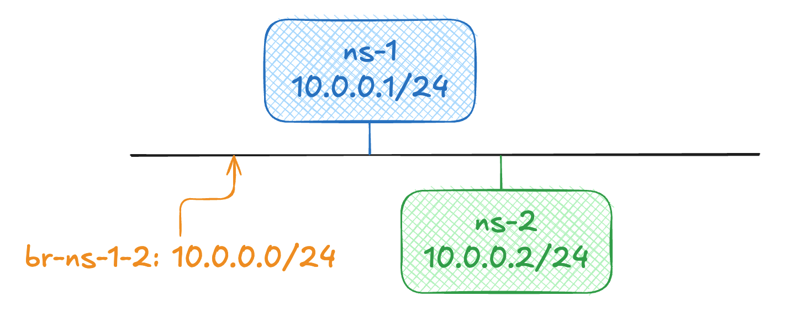

# Basic Topology

This [basic example](./topo_template.yaml) show the topologya s below:



This topology will create two namespace connected on a central bridge with 10.0.0.0/24.

## Usage

- Apply

    ```bassh
    sudo nsctl topo apply topo_template.yaml
    ```

- Delete

    ```bassh
    sudo nsctl topo delete topo_template.yaml
    ```

- Execute Command

    ```bash
    sudo nsctl exec [ns-1|ns-2] -- <cmd>
    ```
